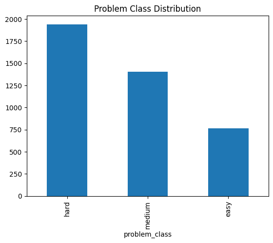
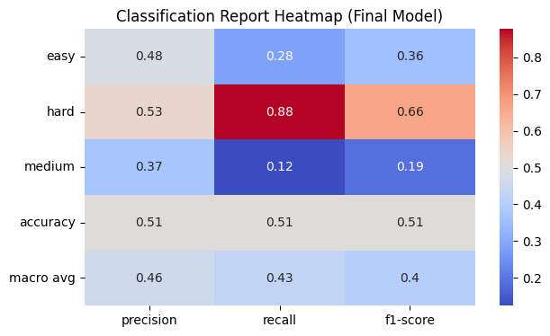
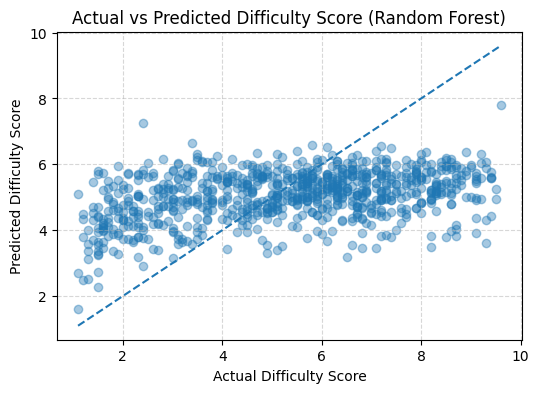
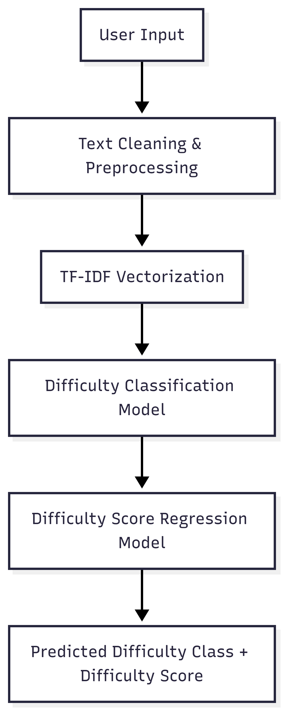

#  AutoJudge: Automatic Prediction of Programming Problem Difficulty Using Textual Analysis

**Author:** Kanishka Gupta  
**Project Type:** Machine Learning + NLP + Web Application  
**Tech Stack:** Python, Pandas, NumPy, Scikit-learn, TF-IDF, Streamlit  

---

##  Project Overview

Online competitive programming platforms classify problems into difficulty levels such as **Easy**, **Medium**, and **Hard**, often accompanied by a numerical difficulty score. These labels are usually assigned manually based on expert judgment or post-contest analysis, which can be **subjective, delayed, and inconsistent**.

**AutoJudge** is an automated machine learning system that predicts:

- **Difficulty Class** (Easy / Medium / Hard)
- **Difficulty Score** (continuous numeric value)

using **only the textual description of a programming problem**.  
The system does **not require historical submission data**, making it suitable for **new or unseen problems**.

A **Streamlit web application** enables real-time difficulty prediction.

---

## 📂 Project Structure
```
AutoJudge/
│
├── app/
│ └── app.py # Streamlit web application
│
├── models/
│ ├── tfidf_vectorizer.pkl # TF-IDF vectorizer
│ ├── difficulty_classifier.pkl # Random Forest classifier
│ └── difficulty_regressor.pkl # Random Forest regressor
│
├── notebooks/
│ ├── 01_data_exploration.ipynb # Exploratory Data Analysis
│ ├── 02_feature_engineering.ipynb # TF-IDF & text processing
│ ├── 03_classification_model.ipynb # Classification models
│ └── 04_regression_model.ipynb # Regression models
│
├── assets/
│ ├── eda_distribution.png # Data exploration visual
│ ├── architecture.png # System architecture diagram
│ ├── classification_results.png # Classification comparison
│ └── regression_results.png # Regression comparison
│
├── requirements.txt
└── README.md
```

---

##  Dataset Description

The dataset consists of programming problems collected from online coding platforms.

### Features:
- Problem Title  
- Problem Description  
- Input Description  
- Output Description  

### Target Variables:
- **problem_class** → Easy / Medium / Hard  
- **problem_score** → Continuous numeric difficulty value  

The dataset is **pre-labeled** and requires no manual annotation.

---

##  Exploratory Data Analysis (EDA)

EDA was performed to understand:

- Class distribution
- Difficulty score spread
- Text length behavior

### Key Observation:
- Hard problems tend to have **longer descriptions**
- Difficulty score increases with **text complexity**

 **Sample EDA Visualization**  


---

##  Feature Engineering

All text fields were combined and transformed using **TF-IDF (Term Frequency–Inverse Document Frequency)**.

### Why TF-IDF?
- Highlights important keywords
- Reduces influence of common words
- Efficient for high-dimensional text data
- Interpretable and model-agnostic

This representation was used for both **classification** and **regression** tasks.

---

##  Difficulty Classification

### Objective
Predict the difficulty class:
- Easy / Medium / Hard


### Models Evaluated
- Logistic Regression
- Support Vector Machine (SVM)
- Random Forest Classifier

### Final Model
 **Random Forest Classifier**

### Final Performance
- **Accuracy:** 0.51

 **Classification Results & Confusion Matrix**  


**Insights:**
- Hard problems are predicted with high recall
- Overlap between Easy and Medium reflects subjective boundaries

---

##  Difficulty Score Regression

### Objective
Predict the continuous difficulty score.

### Models Evaluated
- Linear Regression
- Random Forest Regressor

### Final Results

| Model | MAE | RMSE |
|------|-----|------|
| Linear Regression | 2.69 | 3.49 |
| Random Forest | **1.71** | **2.05** |

**Regression Performance Comparison**  


**Insight:**  
Random Forest captures non-linear patterns better than Linear Regression.

---
## System Architecture
<p align="center">
  
</p>


**Flow:**
1. User enters problem text  
2. Text preprocessing & cleaning  
3. TF-IDF vectorization  
4. Classification model predicts difficulty class  
5. Regression model predicts difficulty score  
6. Results displayed via web interface  

---

##  Web Interface Explanation

**AutoJudge** includes an interactive **Streamlit-based web application** that enables users to predict the difficulty of a programming problem in **real time** using only its **textual description**.

###  Interface Components

####  Text Input Area
Users can paste the complete programming problem text, including the **title**, **description**, and **input/output specifications**, into the provided text fields.

####  Predict Button
Initiates the machine learning inference pipeline by processing the input text through the trained NLP and prediction models.

####  Prediction Output
The application displays the following results:

- **Predicted Difficulty Class**: Easy / Medium / Hard  
- **Predicted Difficulty Score**: A continuous numeric value representing estimated problem complexity

The interface is designed to be **simple, responsive, and user-friendly**, making AutoJudge suitable for quick evaluation and practical usage.


##  Web Application

The Streamlit web interface allows users to:

- Paste a problem description
- Click **Predict Difficulty**
- Instantly view:
  - Difficulty Class
  - Difficulty Score

The app runs locally and requires no external APIs.

---

###  How to Run Locally

###  Clone the Repository
```bash
git clone https://github.com/your-username/AutoJudge.git
cd AutoJudge
```
###  Create Virtual Environment
```
python -m venv venv
# Windows
venv\Scripts\activate
# Linux/Mac
source venv/bin/activate
```

###  Install Dependencies
```
pip install -r requirements.txt
```

### 4. Run the Web App
```
streamlit run app/app.py
```
### 5. Demo Video

- **Demo Video (2–3 minutes):**  
👉 [Watch on Google Drive](https://drive.google.com/file/d/1I5jTJSMbkrvm5KTmq9sNNy98vf6nD4cG/view?usp=sharing)  
👉 [Download from GitHub](demo/demo_video.mp4)

## Conclusion

**AutoJudge** demonstrates that the difficulty of programming problems can be accurately predicted using **textual descriptions alone**.  
By combining **Natural Language Processing (NLP)** techniques with **machine learning classification and regression models**, the system delivers:

- **Automated difficulty labeling** (Easy / Medium / Hard)
- **Continuous difficulty scoring** for finer granularity
- **Real-time predictions** through an interactive Streamlit web interface

This approach is **efficient**, **interpretable**, and **scalable**, making it well-suited for real-world applications such as **online judges**, **educational platforms**, and **problem recommendation systems**.

##  Author & Project Details

**Name:** Kanishka Gupta  
**Institute:** Indian Institute of Technology (IIT) Roorkee  
 

###  Project Information
- **Project Title:** AutoJudge – Automatic Prediction of Programming Problem Difficulty  
- **Domain:** Machine Learning, Natural Language Processing, Web Applications  

###  Project Overview
This project was developed as an **academic and applied machine learning system** that demonstrates the use of **text-based NLP features** combined with **ensemble learning models** to automatically estimate the difficulty level of programming problems.  
The system emphasizes practical usability, interpretability, and real-time prediction through a web-based interface.


